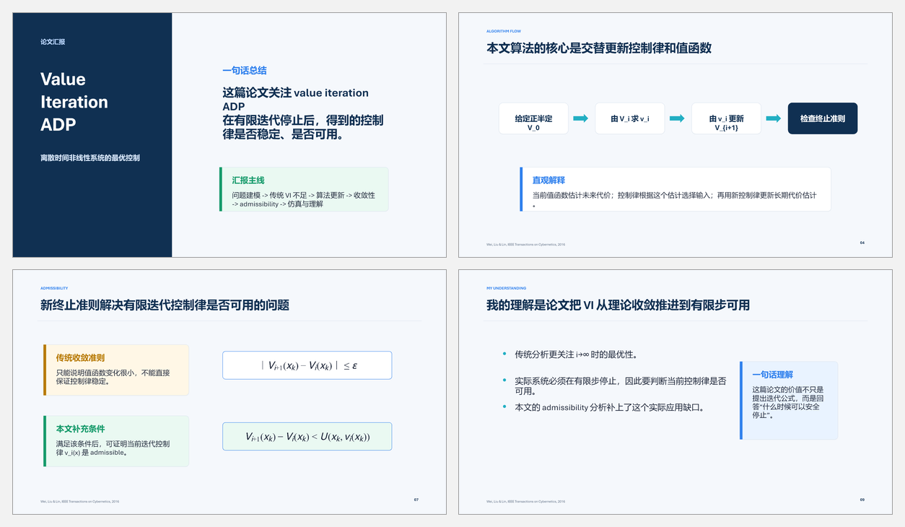

# Value-Iteration ADP Presentation Toolkit

> Source scripts and final artifacts for explaining value-iteration adaptive
> dynamic programming to a technical audience.

[](https://developer.mozilla.org/docs/Web/JavaScript)
[](https://www.python.org/)


This project turns a control-theory paper into a concise Chinese presentation,
speaker script, equations, algorithm flow, and practical interpretation. The
source material is Wei, Liu, and Lin, *IEEE Transactions on Cybernetics* (2016).

中文简介：将 value-iteration ADP 论文整理成 10 页中文汇报、配套讲稿和可重复
生成脚本，重点解释有限迭代后控制律“是否可用”的判定问题。



## Scope

This is a **paper-explanation and presentation-engineering project**. It does
not claim to be a full numerical reproduction of the paper's control
experiments.

## Deliverables

- [Ten-slide presentation](outputs/ADP_论文汇报_10页思路版.pptx)
- [Chinese speaker script](outputs/ADP论文汇报讲稿.docx)
- `build_adp_outline_10slides.mjs`: final outline-oriented deck generator.
- `build_adp_speech_docx.py`: matching Word script generator.
- Earlier deck generators are retained to show the iteration process.

## Narrative

```text
Nonlinear optimal-control problem
              |
              v
   Value-iteration ADP update
              |
              v
 Convergence is not enough for deployment
              |
              v
  Admissibility-based stopping condition
              |
              v
 Critic/action network implementation
```

The presentation focuses on the practical gap between asymptotic convergence
and a controller that can safely stop after a finite number of iterations.

## Topics covered

- Bellman and value-iteration updates for nonlinear discrete-time systems.
- Convergence properties and stopping criteria.
- Admissibility of the finite-iteration control policy.
- Critic and action network roles.
- Interpretation of the paper's simulation section.

## Regenerating the speaker script

```powershell
git clone https://github.com/sclm3010/adp-presentation-toolkit.git
cd adp-presentation-toolkit
python -m pip install -r requirements.txt
python build_adp_speech_docx.py
```

## Regenerating the slides

The slide generators were built around the Codex desktop artifact runtime.

```powershell
pnpm install
node build_adp_outline_10slides.mjs
```

They locate the bundled runtime under `~/.cache/codex-runtimes` by default. If
your runtime is stored elsewhere, set `CODEX_RUNTIME_ROOT` to its
`dependencies` directory. The checked-in `.pptx` remains available even when
that runtime is not installed.

## Repository structure

```text
adp-presentation-toolkit/
  build_adp_outline_10slides.mjs  # Final deck generator
  build_adp_report_deck*.mjs      # Earlier design iterations
  build_adp_speech_docx.py        # Speaker-script generator
  assets/adp-deck-preview.png     # README preview
  outputs/                        # Final PowerPoint and Word files
```

## Design principles

- One central idea per slide.
- Equations paired with plain-language interpretation.
- Clear distinction between convergence and finite-iteration usability.
- Explicit scope boundaries between paper explanation and code reproduction.
